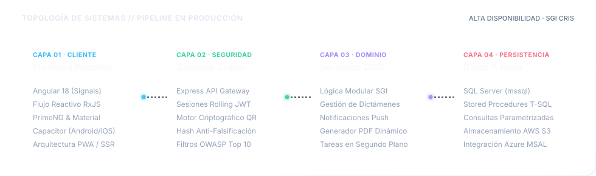
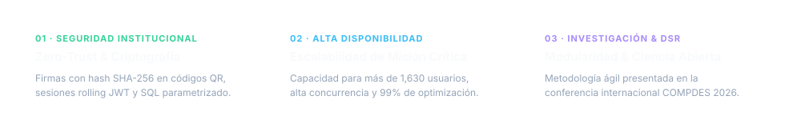
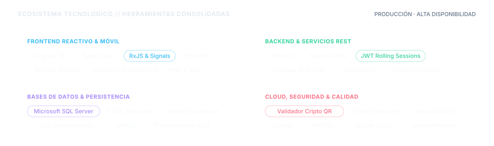
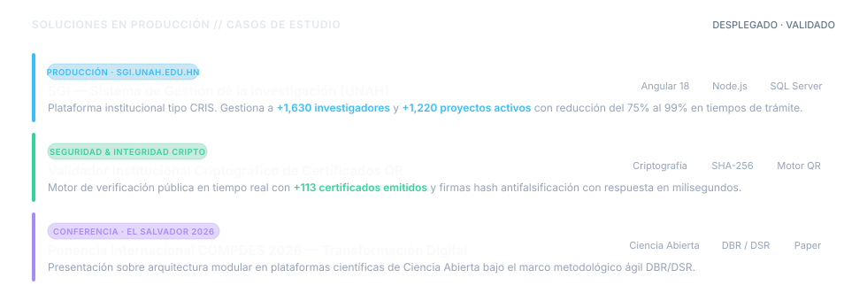

<!-- APPLE MACOS GLASS HERO WINDOW -->

  

<!-- MINIMALIST VISITOR BADGE -->

---

### Arquitectura de Sistemas &amp; Pipeline de Producción

> Topología desacoplada de cuatro capas en producción institucional para el Sistema de Gestión de la Investigación (UNAH), integrando interfaces reactivas en cliente, gateway criptográfico, servicios modulares de dominio y persistencia relacional transaccional.

  

---

### Principios de Ingeniería &amp; Estándares de Calidad

> Directrices técnicas orientadas a robustez institucional, tolerancia a fallos, mantenibilidad a largo plazo y seguridad integral de datos.

  

---

### Ecosistema Tecnológico &amp; Herramientas

> Lenguajes, librerías y servicios aplicados en entornos de alta concurrencia y despliegues oficiales.

  

---

### Soluciones en Producción &amp; Casos de Estudio

> Software de misión crítica desplegado y utilizado activamente en la gestión científica y académica universitaria.

  

  &nbsp;&nbsp;
  &nbsp;&nbsp;
  

---

### Canales Directos &amp; Red Profesional

&nbsp;&nbsp;
&nbsp;&nbsp;
&nbsp;&nbsp;
&nbsp;&nbsp;

  

  Arquitectura e ingeniería de software · <strong>Luis Leonel Mejía Romero</strong> · Tegucigalpa, Honduras

