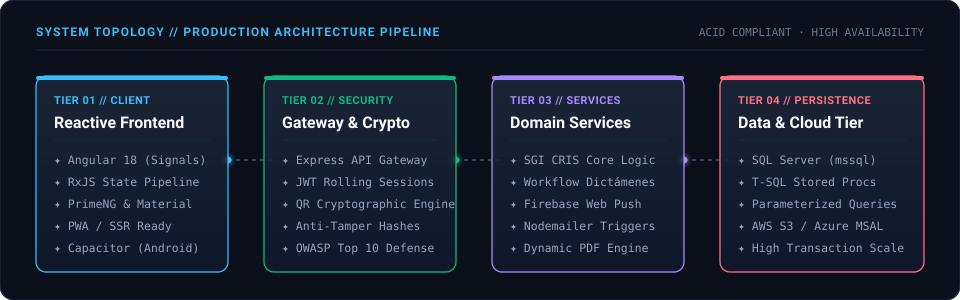
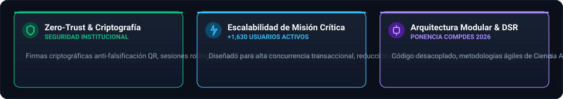
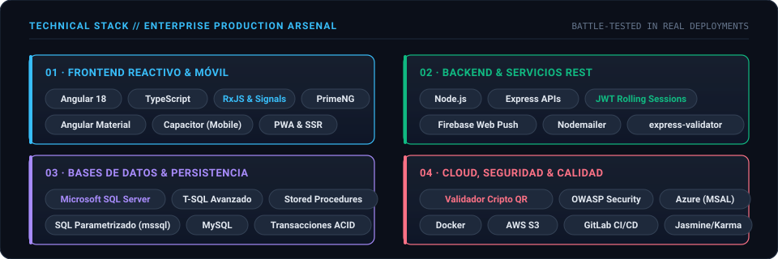
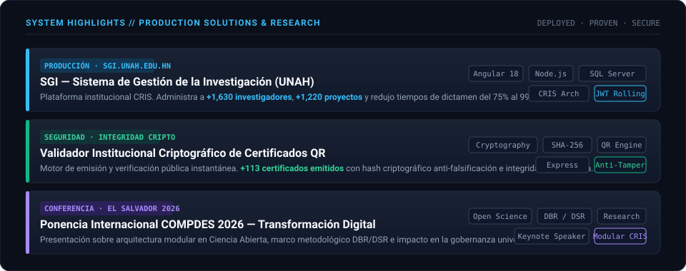

<!-- HERO COCKPIT HEADER -->

  

<!-- ANIMATED TYPING EXECUTIVE BADGE -->

 

<!-- PROFILE VIEWS TELEMETRY -->

---

### 🏛️ Topología de Sistemas & Pipeline Full Stack

> Arquitectura desacoplada de cuatro capas en producción real para el **SGI (Sistema de Gestión de la Investigación - UNAH)**, integrando reactividad en cliente, validaciones criptográficas en gateway, lógica de negocio modular y persistencia relacional transaccional.

  

---

### 🛡️ Principios de Ingeniería & Estándares de Calidad

> Diseñado bajo estrictas normas de robustez institucional, priorizando integridad de datos, tolerancia a fallos y mantenibilidad a largo plazo.

  

---

### ⚡ Arsenal Técnico & Ecosistema Empresarial

> Herramientas, lenguajes y servicios consolidados en sistemas desplegados con alta concurrencia y cero tolerancia a brechas de seguridad.

  

---

### 💼 Casos de Estudio & Proyectos de Misión Crítica

> Soluciones de software gubernamental y universitario con impacto directo en miles de usuarios activos y gobernanza digital.

  

  &nbsp;&nbsp;
  &nbsp;&nbsp;
  

---

### 📊 Telemetría de Código & Actividad Global

  

&nbsp;

---

### 📬 Canales Directos & Red Profesional

&nbsp;&nbsp;
&nbsp;&nbsp;
&nbsp;&nbsp;
&nbsp;&nbsp;

  

  Desarrollado con precisión arquitectónica por <strong>Luis Leonel Mejía Romero</strong> · Tegucigalpa, Honduras

